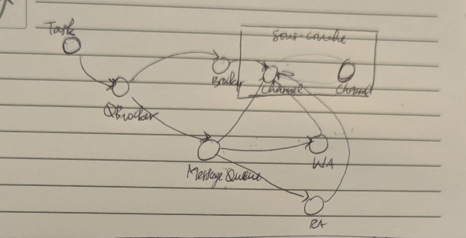
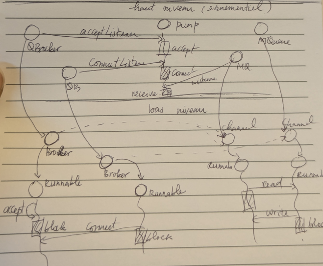
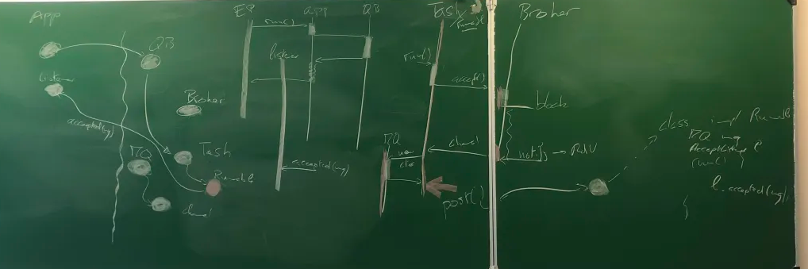

Nom : **NGUEGANG KOWO Laura stefy**

**Organisation du projet**

Le projet est organisé selon une séparation claire entre les interfaces publiques, les implémentations concrètes, et les classes de test.

Structure des packages

* un package *private.info5.sar* — contient les implémentations concrètes : 
    - *async* pour la version asynchrone/évènemenetielle
    - *channels* version de base implémentant les mécanismes de Broker et Channel.
    - *queue* pour la surcouche bloquante

* un package *public.info5.sar* - contient les interfaces, classes abstraites et utilitaires exposées publiquement.
* un package *src/test* : ontient les classes de test permettant de valider les différentes couches de l’architecture.

# VERSION 1 - CAS DE BASE BROKER - CHANNEL

Cette première version constitue le socle de communication entre deux entités (brokers) capables d’établir des connexions point à point à l’aide de channels.


- **Broker** : intermédiaire nommé, capable d’ouvrir ou d’accepter des connexions sur un port.
- **Channel** : canal de communication bidirectionnel, FIFO et sans perte, reliant deux brokers.
- **BrokerManager** : gestionnaire global maintenant la correspondance entre noms de brokers et instances concrètes, garantissant leur unicité.

## Mécanisme de connexion
L’établissement d’une connexion repose sur un rendez-vous symétrique entre :
- un broker exécutant un accept(port), et
- un autre broker effectuant un connect(name, port) vers ce premier.

Chaque broker possède un **RendezVousManager**, responsable de la gestion des demandes d’acceptation actives sur ses ports.

Le principe est implémenté via une classe RDV :
```
public class RDV {
	private int port;
	private boolean pendingAccept = false;
	private boolean pendingConnect = false;
	private CChannel acceptChannel;
	private CChannel connectChannel;
	private boolean valid = true;
	
	public RDV(int port) {
		this.port = port;
	}
		
	public synchronized CChannel come(CBroker broker, Type type) throws InterruptedException {
		switch(type) {}
	}

	public void linkChannels() {}
	
	public boolean isValid() {}
}
```
Le rendez-vous devient valide lorsque les deux opérations (CONNECT et ACCEPT) se rencontrent.
Il est ensuite consommé, c’est-à-dire rendu invalide, après l’établissement du canal.

## Envoie des messages
Une fois la connexion établie :
- chaque broker dispose d’un channel connecté à l’autre ;
- chaque channel maintient un buffer de lecture et un buffer d’écriture.

L’écriture sur un channel correspond donc à la lecture sur le channel opposé.
Cette abstraction permet de simuler un flux bidirectionnel de bytes, assurant une communication complète entre les deux extrémités.

# SURCOUCHE 1 - VERSION BLOQUANTE QBROKER, MESSAGE QUEUE


Cette version introduit la notion de message structuré, envoyés et reçus sous forme de blocs de bytes.Pour cela, deux automates sont mis en place : un pour la lecture et un pour l’écriture.

- **Automate de lecture**

L’automate de lecture permet de découper le flux en messages individuels :
* Lecture des 4 premiers octets pour déterminer la taille du message.
* Lecture du contenu complet sur la longueur spécifiée.
* Transmission du message au consommateur (blocant jusqu’à lecture complète).

- **Automate d’écriture**

L’automate d’écriture réalise le processus inverse :
* Écrit la taille du message (4 octets en en-tête).
* Écrit ensuite le contenu du message complet.
* Assure le respect du format attendu côté lecture.

Cette surcouche rend la communication plus structurée et fiable, tout en conservant la garantie FIFO et la sûreté des échanges.

# SURCOUCHE 2 - VERSION EVENEMENTIELLE



La dernière surcouche introduit une approche asynchrone pilotée par événements, reposant sur une pompe à événements (EventPump).
L’objectif est d’éviter les interblocages et de séparer la logique applicative de la gestion bas-niveau des opérations d’E/S.